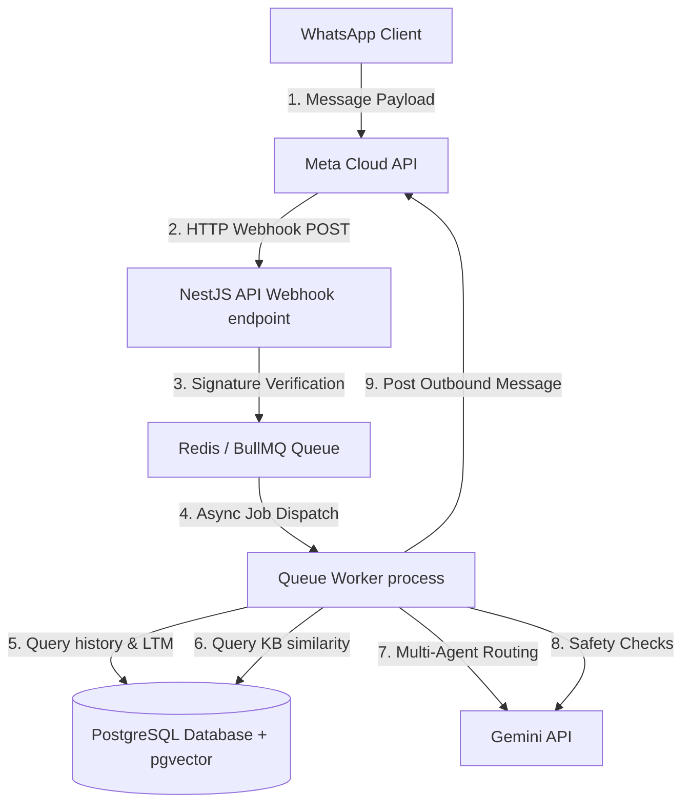
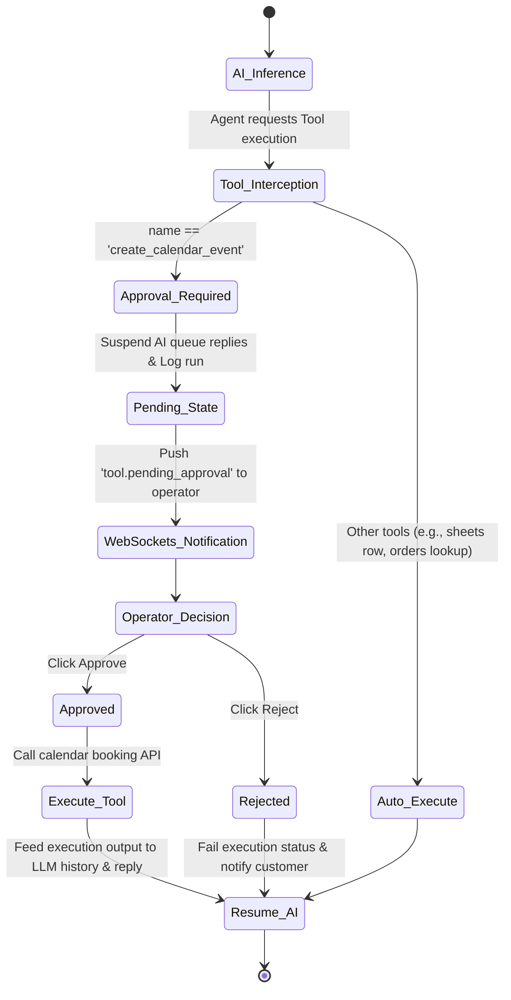

# System Architecture Overview

This document describes the high-level architecture, message processing pipeline, and integrations layout of the WhatsAI platform.

---

## High-Level Architecture Flow

---

## 1. Message Ingestion & Processing Queue
1.  **Meta Cloud Webhook**: Payload is received at `POST /webhooks/meta/whatsapp`.
2.  **Signature Verification**: The signature is verified using HMAC-SHA256 signature hashes and `META_VERIFY_TOKEN`.
3.  **Idempotency & Enqueuing**: Message ID is cross-checked in the database to prevent duplicate processing, and the message is enqueued to `incoming-message` queue via BullMQ.
4.  **Asynchronous processing**: The API thread immediately returns `200 OK` under 500ms, offloading RAG lookup and LLM inference to separate worker processes.

---

## 2. AI Execution & RAG Pipeline
*   **Active Agent Classification**: The incoming message triggers `RouterService` to classify customer intent and dynamically route the query to the correct active specialized agent system prompt.
*   **RAG Retrieval**: Generates embedding vector (768 dimensions) using `text-embedding-004` and queries database using cosine similarity searches on `knowledge_chunks`.
*   **Context Assembly**: Pulls last 20 messages history, strict RAG chunks, and custom customer memory facts, keeping prompts within the token budget.
*   **Outbound Validation**: Safety filters scrub PII templates (masked as `[EMAIL MASKED]`/`[PHONE MASKED]`) and mask profanities with `****` before delivery.

---

## 3. Human-in-the-loop Tool Approvals
Sensitive agent tool calls (e.g., creating a calendar event) require human approval:

