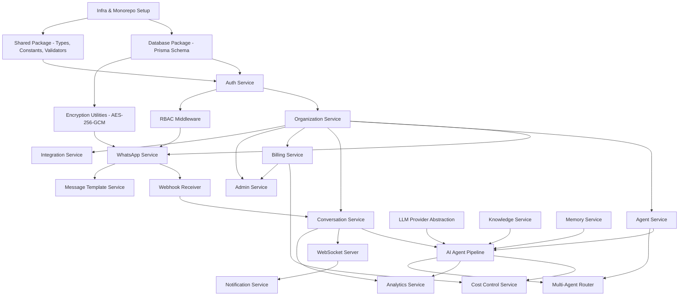

# Implementation Roadmap: WhatsApp AI Platform

**Source of Truth:** [PRD v2.0](file:///Users/nikitasingh/Desktop/WhatsAI/docs/prd/prd-v2.md) · [TDD v2.0](file:///Users/nikitasingh/Desktop/WhatsAI/docs/tdd/tdd-v2.md)
**Status:** Draft — Pending Approval
**Date:** 2026-07-17

---

## Executive Summary

The project is organized into **6 milestones** mapped directly to the PRD v2.0 release roadmap. Milestones 1–2 constitute the **MVP** (PRD v0.1 + v0.2). Milestones 3–6 are **post-MVP production features**.

Each milestone is decomposed into **phases** (logical groupings), and each phase into **tasks** (implementable units). Dependencies, critical path items, parallel tracks, and complexity are identified throughout.

| Milestone | PRD Version | Classification | Complexity | Phases |
|-----------|-------------|----------------|------------|--------|
| 1. Foundation | v0.1 | **MVP** | High | 7 |
| 2. Usable AI Assistant | v0.2 | **MVP** | High | 7 |
| 3. SaaS Readiness | v0.3 | Post-MVP | High | 6 |
| 4. Agentic Workflows | v0.4 | Post-MVP | Medium | 4 |
| 5. Growth Features | v0.5 | Post-MVP | Medium | 3 |
| 6. Public Launch | v1.0 | Post-MVP | Medium | 2 |

---

## Module Dependency Graph

Understanding inter-module dependencies is essential for sequencing work correctly. The graph below reads top-to-bottom: modules at the top are foundational; modules below depend on those above.



---

## Critical Path

The **critical path** is the longest chain of dependent tasks that determines the minimum project duration. Any delay on these items delays the entire MVP.

```
Monorepo Setup → Database Schema → Auth Service → Organization Service 
→ WhatsApp Service → Webhook Receiver → Conversation Service 
→ LLM Provider Abstraction → AI Agent Pipeline → Outbound Message Sender
→ End-to-End Webhook-to-Reply Flow
```

> **CAUTION:** All items on the critical path are **sequential dependencies**. They cannot be parallelized relative to each other. Prioritize staffing and unblocking these tasks above all others.

---

## Parallel Development Tracks

Once the foundational layers (infra, database, auth) are established, work can proceed on **three parallel tracks**:

| Track | Modules | Starts After |
|-------|---------|--------------|
| **Track A: Core Pipeline** (Critical Path) | WhatsApp Service → Webhook → Conversations → AI Pipeline → Outbound Sending | Auth + Org complete |
| **Track B: Knowledge & Memory** | Knowledge Service (upload, chunk, embed, retrieve) + Memory Service | Database schema + Shared package complete |
| **Track C: Frontend Shell** | Dashboard layout, navigation, empty states, org settings, agent config UI | Auth complete (can use mocked API) |

In Milestone 2, two more parallel tracks open:

| Track | Modules | Starts After |
|-------|---------|--------------|
| **Track D: Real-Time** | WebSocket server, inbox real-time updates, presence, typing indicators | Conversation Service complete |
| **Track E: Agent UX** | Prompt version history UI, diff view, simulator, working hours config UI | Agent Service complete |

---

## Milestone 1: Foundation (PRD v0.1)

**Goal:** Deployable backend with auth, organizations, WhatsApp connection, webhook receiver, and a single configured AI agent. Dashboard shell with navigation and empty states.

**Complexity:** High

**Classification:** MVP

---

### Phase 1.1: Infrastructure & Monorepo

**Track:** All (unblocks everything)
**Dependencies:** None — this is the starting point.

| # | Task | Layer | Complexity | Critical Path |
|---|------|-------|------------|---------------|
| 1.1.1 | Initialize monorepo structure: `apps/web`, `apps/api`, `packages/database`, `packages/shared`, `packages/ai`, `packages/integrations`, `packages/notifications` | Infra | Low | Yes |
| 1.1.2 | Configure TypeScript, ESLint, Prettier for monorepo with shared configs | Infra | Low | |
| 1.1.3 | Set up Next.js app in `apps/web` with Tailwind CSS and Shadcn/UI | Frontend | Low | |
| 1.1.4 | Set up NestJS (or Express) app in `apps/api` with module structure | Backend | Low | Yes |
| 1.1.5 | Configure Docker Compose for local development (PostgreSQL + pgvector, Redis) | Infra | Low | |
| 1.1.6 | Set up environment variable management (`.env.example`, validation on startup) | Infra | Low | Yes |
| 1.1.7 | Configure CI pipeline: TypeScript check, lint, test, build for all packages | Infra | Low | |

---

### Phase 1.2: Database Package & Shared Types

**Track:** All (unblocks all services)
**Dependencies:** Phase 1.1 complete.

| # | Task | Layer | Complexity | Critical Path |
|---|------|-------|------------|---------------|
| 1.2.1 | Define Prisma schema for Milestone 1 tables: `users`, `user_mfa_methods`, `organizations`, `organization_members`, `invitations`, `onboarding_progress`, `whatsapp_accounts`, `agents`, `agent_versions`, `whatsapp_account_agents`, `contacts`, `conversations`, `messages`, `webhook_events`, `audit_logs` | Package | Medium | Yes |
| 1.2.2 | Configure pgvector extension in Prisma schema (for future knowledge/memory chunks) | Package | Low | |
| 1.2.3 | Generate and run initial Prisma migration | Package | Low | Yes |
| 1.2.4 | Create shared type definitions: user, org, roles, WhatsApp account, agent, conversation, message, webhook event | Package | Medium | |
| 1.2.5 | Create shared constants: role enums, status enums, conversation lifecycle states, message types, agent types | Package | Low | |
| 1.2.6 | Create shared validators: email, phone number, org name, plan limits | Package | Low | |

---

### Phase 1.3: Encryption & Security Utilities

**Track:** A (unblocks WhatsApp token storage)
**Dependencies:** Phase 1.1 complete.

> **NOTE:** The encryption module is a **shared utility** used by WhatsApp Service (tokens), Integration Service (credentials), and Auth Service (MFA secrets). Build it once, use everywhere.

| # | Task | Layer | Complexity | Critical Path |
|---|------|-------|------------|---------------|
| 1.3.1 | Implement AES-256-GCM encrypt/decrypt utility using `ENCRYPTION_KEY` from environment | Package | Medium | Yes |
| 1.3.2 | Implement constant-time HMAC-SHA256 signature verification utility (for Meta webhooks) | Package | Low | Yes |
| 1.3.3 | Unit tests for encryption (round-trip, key rotation, error cases) and signature verification | Package | Low | |

---

### Phase 1.4: Auth Service

**Track:** A + C (unblocks all authenticated features)
**Dependencies:** Phase 1.2 (database), Phase 1.3 (encryption for MFA secrets).

| # | Task | Layer | Complexity | Critical Path |
|---|------|-------|------------|---------------|
| 1.4.1 | Implement email/password signup with bcrypt password hashing | Backend | Medium | Yes |
| 1.4.2 | Implement email verification flow (generate token, send email, verify endpoint) | Backend | Medium | Yes |
| 1.4.3 | Implement email/password login with session creation (HttpOnly, SameSite, 24-hour sliding window) | Backend | Medium | Yes |
| 1.4.4 | Implement Google OAuth flow (Auth.js/NextAuth integration) | Backend | Medium | |
| 1.4.5 | Implement password reset flow (email link, token, reset endpoint) | Backend | Low | |
| 1.4.6 | Implement MFA/TOTP enrollment (generate secret, encrypt with AES-256-GCM, store in `user_mfa_methods`, return QR code) | Backend | High | |
| 1.4.7 | Implement MFA/TOTP verification during login (challenge, verify code) | Backend | Medium | |
| 1.4.8 | Implement brute-force protection (track `login_attempts`, lock at 5/10 attempts, unlock via email) | Backend | Medium | |
| 1.4.9 | Implement RBAC middleware (extract user, validate org membership, check role permissions) | Backend | High | Yes |
| 1.4.10 | Implement `GET /api/me` and `GET /api/me/organizations` endpoints | Backend | Low | |
| 1.4.11 | Set up email provider integration (Resend/SendGrid/SES) for transactional emails | Backend | Medium | |
| 1.4.12 | Build signup, login, email verification, and password reset frontend pages | Frontend | Medium | |
| 1.4.13 | Build MFA enrollment and verification frontend flow | Frontend | Medium | |

---

### Phase 1.5: Organization Service

**Track:** A (unblocks WhatsApp + Agent)
**Dependencies:** Phase 1.4 (auth, RBAC).

| # | Task | Layer | Complexity | Critical Path |
|---|------|-------|------------|---------------|
| 1.5.1 | Implement `POST /api/organizations` (create org, enforce max 3 per user, initialize onboarding progress) | Backend | Medium | Yes |
| 1.5.2 | Implement `GET/PATCH /api/organizations/:orgId` (read/update org profile) | Backend | Low | |
| 1.5.3 | Implement team invitation flow: `POST /api/organizations/:orgId/invitations` (generate token, send email, 7-day expiry) | Backend | Medium | |
| 1.5.4 | Implement invitation acceptance: `POST .../invitations/:token/accept` (add member, auto-apply on signup) | Backend | Medium | |
| 1.5.5 | Implement `GET/PATCH/DELETE /api/organizations/:orgId/members/:memberId` (role changes, billing_access toggle, removal) | Backend | Medium | |
| 1.5.6 | Implement tenant isolation middleware (validate `organization_id` from route matches user's membership) | Backend | High | Yes |
| 1.5.7 | Implement `GET /api/organizations/:orgId/onboarding` (checklist state) | Backend | Low | |
| 1.5.8 | Build organization creation and profile settings frontend pages | Frontend | Medium | |
| 1.5.9 | Build team management frontend (member list, invite form, role selector, billing access toggle) | Frontend | Medium | |
| 1.5.10 | Build org switcher dropdown in dashboard header (persist active org in session) | Frontend | Low | |

> **NOTE:** Ownership transfer and organization deletion (30-day grace period) are deferred to **Milestone 3** per PRD v2.0 roadmap. The schema supports them from day one.

---

### Phase 1.6: WhatsApp Service & Webhook Receiver

**Track:** A (Critical Path)
**Dependencies:** Phase 1.5 (organizations), Phase 1.3 (encryption for tokens).

| # | Task | Layer | Complexity | Critical Path |
|---|------|-------|------------|---------------|
| 1.6.1 | Implement WhatsApp account connection — manual setup path: validate credentials via Meta Graph API, encrypt token, store in `whatsapp_accounts` | Backend | High | Yes |
| 1.6.2 | Implement WhatsApp account connection — Embedded Signup path: handle OAuth callback from Meta, exchange code for System User token, encrypt and store | Backend | High | Yes |
| 1.6.3 | Enforce Phone Number ID global uniqueness (reject connection if already used by another org) | Backend | Low | Yes |
| 1.6.4 | Implement `GET /webhooks/meta/whatsapp` — Meta webhook verification (hub.mode, hub.verify_token, hub.challenge) | Backend | Low | Yes |
| 1.6.5 | Implement `POST /webhooks/meta/whatsapp` — receive payload, verify HMAC-SHA256 signature, store in `webhook_events`, return 200 within 500ms | Backend | High | Yes |
| 1.6.6 | Implement webhook payload parser: extract phone_number_id, message type, sender, content, media URLs, status updates | Backend | High | Yes |
| 1.6.7 | Implement organization resolver: phone_number_id → whatsapp_account → organization_id | Backend | Medium | Yes |
| 1.6.8 | Implement message deduplication by WhatsApp message ID | Backend | Low | Yes |
| 1.6.9 | Implement outbound WhatsApp message sender (call Meta Cloud API with org's encrypted access token) | Backend | High | Yes |
| 1.6.10 | Implement token expiry tracking: scheduled job checks `token_expires_at`, logs warnings at 7d/1d | Backend | Medium | |
| 1.6.11 | Implement `GET .../whatsapp-accounts/:accountId/diagnostics` (webhook URL reachability, last event, signature status, token validity) | Backend | Medium | |
| 1.6.12 | Set up BullMQ queues: `incoming-message`, `outbound-message` | Backend | Medium | Yes |
| 1.6.13 | Build WhatsApp account connection frontend (Embedded Signup iframe + manual setup form) | Frontend | High | |
| 1.6.14 | Build WhatsApp account management page (list accounts, status indicators, diagnostics link) | Frontend | Medium | |

---

### Phase 1.7: Agent Service (Basic) & Deployment

**Track:** A (final critical path tasks in M1) + Infra
**Dependencies:** Phase 1.5 (organizations), Phase 1.2 (database).

| # | Task | Layer | Complexity | Critical Path |
|---|------|-------|------------|---------------|
| 1.7.1 | Implement agent CRUD: `POST/GET/PATCH /api/organizations/:orgId/agents` (name, type, system_prompt, tone, language, status) | Backend | Medium | Yes |
| 1.7.2 | Implement agent activation and assignment to WhatsApp number (`whatsapp_account_agents` — 1:1 in MVP) | Backend | Medium | Yes |
| 1.7.3 | Implement basic prompt version creation on agent save (`agent_versions` table) | Backend | Medium | |
| 1.7.4 | Implement health endpoints: `GET /health`, `/health/db`, `/health/redis`, `/health/queue` | Backend | Low | |
| 1.7.5 | Integrate Sentry for error tracking (backend + frontend) | Infra | Low | |
| 1.7.6 | Implement structured JSON logging with correlation IDs (request_id, organization_id, user_id) | Backend | Medium | |
| 1.7.7 | Build agent creation and configuration frontend page (form with fields: name, type, system prompt, tone, language) | Frontend | Medium | |
| 1.7.8 | Build dashboard shell: navigation sidebar, header with org switcher, onboarding checklist, empty states for all sections | Frontend | High | |
| 1.7.9 | Configure production deployment: separate web process, worker process | Infra | Medium | Yes |
| 1.7.10 | Set up managed PostgreSQL and Redis instances | Infra | Low | Yes |
| 1.7.11 | Configure secrets management for production environment variables | Infra | Low | |

---

### Milestone 1 Deliverables

- User can sign up, verify email, enable MFA, log in
- User can create an organization and invite team members
- User can connect a WhatsApp Business account (Embedded Signup or manual)
- Webhook endpoint receives and verifies Meta events
- Webhook events are stored and deduplicated
- Organization is resolved from Phone Number ID
- User can create and configure a single AI agent
- Agent can be assigned to a WhatsApp number
- Health endpoints and Sentry are live
- Backend is deployed with web + worker processes
- Dashboard shell renders with navigation and empty states

---

## Milestone 2: Usable AI Assistant (PRD v0.2)

**Goal:** End-to-end AI-powered WhatsApp conversations. Customer messages arrive via webhook, AI processes with knowledge and memory, reply is sent back. Dashboard shows real-time inbox with human takeover.

**Complexity:** High

**Classification:** MVP

---

### Phase 2.1: LLM Provider Abstraction & AI Pipeline Core

**Track:** A (Critical Path)
**Dependencies:** Phase 1.6 (webhook + outbound sender), Phase 1.7 (agent service).

| # | Task | Layer | Complexity | Critical Path |
|---|------|-------|------------|---------------|
| 2.1.1 | Implement `LLMProvider` interface (`generateChatCompletion`, `generateEmbedding`) in `packages/ai` | Package | Medium | Yes |
| 2.1.2 | Implement `GeminiProvider` (primary): chat completion with tool-calling support, embedding generation | Package | High | Yes |
| 2.1.3 | Implement provider selection via configuration (env-based, defaults to Gemini) | Package | Low | Yes |
| 2.1.4 | Implement AI pipeline orchestrator (steps 1-28 from TDD Section 9): | Backend | High | Yes |
| | — Load org, WhatsApp account, conversation, contact | | Low | Yes |
| | — Check AI status, 24-hour window, working hours | | Medium | Yes |
| | — Select agent (single agent in MVP) | | Low | Yes |
| | — Retrieve recent messages (last 20) | | Low | Yes |
| | — Assemble context within 8K token budget (system prompt + messages + truncation logic) | | High | Yes |
| | — Generate response via LLM | | Medium | Yes |
| | — Send outbound WhatsApp reply | | Medium | Yes |
| | — Store outbound message and agent run metadata (tokens, cost, latency) | | Medium | Yes |
| 2.1.5 | Implement 24-hour messaging window enforcement: check `window_expires_at` before every outbound message | Backend | Medium | Yes |
| 2.1.6 | Implement working hours check with 3 modes (auto_reply, queue, always_on) | Backend | Medium | |
| 2.1.7 | Implement AI disclosure: prepend configurable first-message disclosure if enabled | Backend | Low | |
| 2.1.8 | Implement 20-second hard timeout with fallback message | Backend | Medium | Yes |
| 2.1.9 | Implement cost tracking per message (log prompt_tokens, completion_tokens, cost_cents in `agent_runs`) | Backend | Medium | |

---

### Phase 2.2: Knowledge Base Service

**Track:** B (parallel to Phase 2.1)
**Dependencies:** Phase 1.2 (database), Phase 2.1.1-2.1.2 (LLM provider for embeddings).

| # | Task | Layer | Complexity | Critical Path |
|---|------|-------|------------|---------------|
| 2.2.1 | Add Prisma schema for `knowledge_bases`, `knowledge_documents`, `knowledge_chunks` (with pgvector `embedding` column) | Package | Low | |
| 2.2.2 | Implement document upload endpoint: validate file type (PDF, DOCX, TXT, MD, CSV), size (25 MB max), org storage quota | Backend | Medium | |
| 2.2.3 | Implement manual FAQ creation endpoint (question + answer as single chunk) | Backend | Low | |
| 2.2.4 | Implement text extraction workers: PDF (pdf-parse), DOCX (mammoth), TXT/MD (raw), CSV (csv-parse) | Backend | High | |
| 2.2.5 | Implement chunking logic: 500-1000 tokens, preserve headings/metadata, CSV rows as chunks, FAQ pairs as chunks | Backend | High | |
| 2.2.6 | Implement embedding generation worker: call `LLMProvider.generateEmbedding`, store vectors in `knowledge_chunks` with model version | Backend | Medium | |
| 2.2.7 | Set up `document-ingestion` BullMQ queue with the full pipeline: extract, chunk, embed, update status | Backend | Medium | |
| 2.2.8 | Implement vector similarity search: embed query, search `knowledge_chunks` by cosine similarity filtered by `organization_id` and agent-assigned KB | Backend | High | |
| 2.2.9 | Implement document replacement: detect same filename, delete old chunks, create new ones | Backend | Medium | |
| 2.2.10 | Implement `POST .../knowledge-bases/:kbId/search` (test search endpoint for admins) | Backend | Low | |
| 2.2.11 | Build knowledge base frontend: file upload, FAQ form, document list with processing status, delete action | Frontend | High | |

---

### Phase 2.3: Memory Service

**Track:** B (parallel to Phase 2.1)
**Dependencies:** Phase 1.2 (database), Phase 2.1.1-2.1.2 (LLM provider for embeddings).

| # | Task | Layer | Complexity | Critical Path |
|---|------|-------|------------|---------------|
| 2.3.1 | Add Prisma schema for `memories` table (with pgvector `embedding` column) | Package | Low | |
| 2.3.2 | Implement short-term memory: update `conversations.short_term_memory` jsonb every 10 messages (LLM-based summarization) | Backend | Medium | |
| 2.3.3 | Implement long-term memory writes: extract useful facts from conversations, assign importance 1-5 via LLM | Backend | High | |
| 2.3.4 | Implement memory capacity enforcement: max 50 facts per contact, evict oldest + lowest-importance when full | Backend | Medium | |
| 2.3.5 | Implement memory write rules: block storage of PII (payment cards, gov IDs, passwords, health data) | Backend | Medium | |
| 2.3.6 | Implement memory retrieval: by contact_id + semantic similarity + importance + recency | Backend | Medium | |
| 2.3.7 | Set up `memory-summarization` BullMQ queue | Backend | Low | |

---

### Phase 2.4: Pipeline Integration (Knowledge + Memory)

**Track:** A (re-converges with B)
**Dependencies:** Phase 2.1 (pipeline core), Phase 2.2 (knowledge), Phase 2.3 (memory).

> **IMPORTANT:** This phase integrates the three parallel tracks into the complete AI pipeline. It is the second critical convergence point after the initial critical path.

| # | Task | Layer | Complexity | Critical Path |
|---|------|-------|------------|---------------|
| 2.4.1 | Integrate knowledge retrieval into pipeline step 12: retrieve top-K knowledge chunks, filtered to agent's assigned KBs | Backend | Medium | Yes |
| 2.4.2 | Integrate memory retrieval into pipeline step 11: retrieve relevant long-term memories for the contact | Backend | Medium | Yes |
| 2.4.3 | Implement context assembly with token budget truncation (step 13): system prompt, business rules, knowledge, memory, messages — truncate if over 8K tokens | Backend | High | Yes |
| 2.4.4 | Implement intent classification and sentiment detection (step 14) via LLM | Backend | Medium | |
| 2.4.5 | Implement escalation rule evaluation (step 15): sentiment threshold, human request detection, max turns, keywords, confidence threshold | Backend | High | |
| 2.4.6 | Implement escalation action (step 16): set conversation to `needs_human`, send acknowledgment to customer, enqueue notification | Backend | Medium | |
| 2.4.7 | Implement strict knowledge mode (step 21): if enabled and no relevant KB found, send fallback message instead | Backend | Low | |
| 2.4.8 | Implement response validation (step 20): PII check, business rule compliance, content safety (profanity/hate speech). Block and escalate on failure. | Backend | High | |
| 2.4.9 | Implement language detection and cross-language response (step 22): respond in customer's detected language | Backend | Medium | |
| 2.4.10 | Implement post-response memory updates (steps 25-26): update short-term summary, extract and store new long-term facts | Backend | Medium | |
| 2.4.11 | Implement source traceability: log `knowledge_chunks_used` and `memory_facts_used` in `agent_runs` | Backend | Low | |
| 2.4.12 | End-to-end integration test: simulated webhook, pipeline, AI response, stored message | Backend | Medium | Yes |

---

### Phase 2.5: Conversation Inbox & WebSocket

**Track:** C + D (parallel to Phases 2.1-2.4 for frontend; WebSocket depends on Conversation Service)
**Dependencies:** Phase 1.6 (webhook stores messages), Phase 1.7 (dashboard shell).

| # | Task | Layer | Complexity | Critical Path |
|---|------|-------|------------|---------------|
| 2.5.1 | Implement `GET /api/organizations/:orgId/conversations` with pagination (25/page, sorted by last_message_at), filters (status, ai_status, assigned, unread, date range) | Backend | Medium | |
| 2.5.2 | Implement `GET .../conversations/:convId/messages` with pagination | Backend | Low | |
| 2.5.3 | Implement full-text search: create tsvector indexes on `messages.text_body` and `conversations`, implement search endpoint | Backend | High | |
| 2.5.4 | Implement conversation lifecycle state machine (New, AI Active, Needs Human, Human Active, Resolved; re-open on new customer message) | Backend | Medium | |
| 2.5.5 | Implement manual reply endpoint: `POST .../conversations/:convId/messages` (check 24-hour window, send via WhatsApp API) | Backend | Medium | |
| 2.5.6 | Implement pause/resume AI: `POST .../pause-ai`, `POST .../resume-ai` | Backend | Low | |
| 2.5.7 | Implement conversation assignment: `PATCH .../conversations/:convId/assign` | Backend | Low | |
| 2.5.8 | Implement internal notes: `GET/POST/DELETE .../conversations/:convId/notes` | Backend | Low | |
| 2.5.9 | Implement delivery status processing: parse Meta status callbacks, update `messages.delivery_status` | Backend | Medium | |
| 2.5.10 | Implement failed message retry: up to 3 attempts with exponential backoff (1s, 4s, 16s) | Backend | Medium | |
| 2.5.11 | Implement WebSocket server: authenticate via session cookie, join org-scoped channels | Backend | High | |
| 2.5.12 | Implement WebSocket events: `new_message`, `conversation_updated`, `conversation_created`, `status_change` | Backend | Medium | |
| 2.5.13 | Implement WebSocket presence: track which operators are viewing a conversation, broadcast `viewing_indicator` | Backend | Medium | |
| 2.5.14 | Implement WebSocket typing indicators: broadcast `typing_indicator` when operator starts typing | Backend | Low | |
| 2.5.15 | Build conversation inbox frontend: list view with filters, search bar, infinite scroll pagination | Frontend | High | |
| 2.5.16 | Build conversation detail view: message history, sender labels, timestamps, delivery status icons, media previews | Frontend | High | |
| 2.5.17 | Build manual reply composer (text input, send button, 24-hour window indicator/countdown) | Frontend | Medium | |
| 2.5.18 | Build internal notes panel | Frontend | Low | |
| 2.5.19 | Integrate WebSocket client: real-time message arrival, conversation status updates, presence indicators, typing indicators | Frontend | High | |
| 2.5.20 | Build concurrent access indicator ("Being viewed by [Name]") | Frontend | Low | |

---

### Phase 2.6: Agent Configuration UX & Simulator

**Track:** E (parallel to Phase 2.5)
**Dependencies:** Phase 1.7 (agent CRUD), Phase 2.1 (pipeline for simulator).

| # | Task | Layer | Complexity | Critical Path |
|---|------|-------|------------|---------------|
| 2.6.1 | Extend agent CRUD with full config fields: business_rules (jsonb editor), escalation_config (form with 5 triggers), working_hours (day-of-week schedule), outside_hours_mode, fallback_message, ai_disclosure settings | Backend | Medium | |
| 2.6.2 | Implement prompt version history: `GET .../agents/:agentId/versions`, max 50 versions with pruning | Backend | Medium | |
| 2.6.3 | Implement version diff: `GET .../agents/:agentId/versions/:versionId/diff` (compare against previous version) | Backend | Medium | |
| 2.6.4 | Implement rollback: `POST .../agents/:agentId/rollback` (creates new version from selected historical version) | Backend | Medium | |
| 2.6.5 | Implement agent simulator: `POST .../agents/:agentId/test` (runs pipeline with test flag, not billed, not stored as real conversation) | Backend | High | |
| 2.6.6 | Implement agent duplicate: `POST .../agents/:agentId/duplicate` | Backend | Low | |
| 2.6.7 | Implement agent archive/restore: `POST .../agents/:agentId/archive`, `POST .../agents/:agentId/restore`. On archive, reassign conversations to default agent. | Backend | Medium | |
| 2.6.8 | Build agent configuration frontend: full form with business rules editor, escalation rule config, working hours scheduler, toggle fields | Frontend | High | |
| 2.6.9 | Build prompt version history UI: version list, diff viewer, rollback button | Frontend | Medium | |
| 2.6.10 | Build agent simulator UI: chat-like interface showing AI reasoning chain (knowledge chunks, memory, intent, escalation decision, tools called) | Frontend | High | |

---

### Phase 2.7: Media Handling, Human Takeover & Billing Stub

**Track:** A + C
**Dependencies:** Phase 2.4 (pipeline), Phase 2.5 (inbox).

| # | Task | Layer | Complexity | Critical Path |
|---|------|-------|------------|---------------|
| 2.7.1 | Implement media message handling in webhook parser: extract media URLs, type, mime_type, caption, location coords | Backend | Medium | |
| 2.7.2 | Implement media acknowledgment in pipeline: non-text messages get appropriate AI acknowledgment per TDD Section 8 media table | Backend | Medium | |
| 2.7.3 | Implement human takeover flow: escalation, set status `needs_human`, send customer acknowledgment, send email notification to operators | Backend | High | |
| 2.7.4 | Implement human resolve: `POST .../resolve` (set status to resolved, re-enable AI on next customer message) | Backend | Low | |
| 2.7.5 | Implement basic Stripe integration stub: `POST .../billing/checkout` (Free + Starter plans only), `POST /webhooks/stripe` (checkout.session.completed only) | Backend | Medium | |
| 2.7.6 | Implement basic usage tracking: count billable messages (outbound via WA API) in `usage_records` | Backend | Medium | |
| 2.7.7 | Implement basic plan limit check: block AI if message limit exceeded | Backend | Medium | |
| 2.7.8 | Build media message display in inbox (image thumbnails, document icons, audio player placeholder, location map preview) | Frontend | Medium | |
| 2.7.9 | Build human takeover UI: "Needs Human" badge, "Take Over" button, "Resolve" button, AI status indicator per conversation | Frontend | Medium | |
| 2.7.10 | Build basic billing page: current plan display, upgrade button (Stripe Checkout redirect) | Frontend | Low | |
| 2.7.11 | Ensure responsive layout for inbox on mobile (min 375px) | Frontend | Medium | |

---

### Milestone 2 Deliverables

- Customer sends WhatsApp message and AI responds using knowledge + memory
- Conversation appears in real-time inbox with WebSocket updates
- AI respects 24-hour window, working hours, strict knowledge mode
- Human takeover pauses AI, operator can reply and resolve
- Knowledge base documents can be uploaded, processed, and used by AI
- Memory stores conversation summaries and contact facts
- Agent simulator shows full reasoning chain
- Prompt version history with diff and rollback works
- Media messages are stored and acknowledged
- Basic Stripe billing tracks usage (Free + Starter)
- Response validation catches PII, business rule violations, safety issues
- Dashboard is responsive on mobile

---

## Milestone 3: SaaS Readiness (PRD v0.3)

**Goal:** Production-grade billing, full RBAC enforcement, admin panel, notifications, audit logs, GDPR compliance, rate limiting, and operational tooling.

**Complexity:** High

**Classification:** Post-MVP

---

### Phase 3.1: Full Billing & Subscription Management

**Dependencies:** Phase 2.7.5 (billing stub).

| # | Task | Layer | Complexity | Critical Path |
|---|------|-------|------------|---------------|
| 3.1.1 | Define all Stripe products/prices: Free, Starter ($29/$24), Growth ($79/$63), Agency ($199/$159), monthly + annual | Backend | Medium | |
| 3.1.2 | Implement full Stripe webhook handler: all 5 event types (checkout.session.completed, invoice.payment_succeeded, invoice.payment_failed, customer.subscription.updated, customer.subscription.deleted) | Backend | High | |
| 3.1.3 | Implement Stripe Customer Portal session creation (`POST .../billing/portal`) | Backend | Low | |
| 3.1.4 | Implement overage enforcement matrix: hard caps per limit type (messages, agents, seats, KB storage, integrations) | Backend | High | |
| 3.1.5 | Implement plan downgrade logic: keep excess resources until period end, deactivate at renewal, notify owner with list of deactivated items | Backend | High | |
| 3.1.6 | Implement failed payment state machine: active, grace_period (7d), suspended/read-only (30d), data_deletion_scheduled (90d) | Backend | High | |
| 3.1.7 | Implement daily AI cost cap enforcement (Cost Control Service): check before each AI request, pause AI if cap reached, notify owner, reset daily | Backend | High | |
| 3.1.8 | Implement anti-abuse: 1 free org per email domain, phone number verification (SMS OTP) for free tier, 3 orgs per user cap | Backend | Medium | |
| 3.1.9 | Implement `GET .../billing/usage` (current period: messages, tokens, cost, utilization %) and `GET .../billing/cost` (AI cost breakdown) | Backend | Medium | |
| 3.1.10 | Build billing dashboard frontend: plan details, usage meters, upgrade/downgrade flow, Stripe portal link, cost breakdown, overage warnings | Frontend | High | |

---

### Phase 3.2: RBAC Hardening, Audit Logs & Org Lifecycle

**Dependencies:** Phase 1.5 (organization service), Phase 1.4 (RBAC middleware).

| # | Task | Layer | Complexity | Critical Path |
|---|------|-------|------------|---------------|
| 3.2.1 | Enforce full permission matrix from PRD Section 5 on every API endpoint (including grantable billing for admins, operator self-assignment, read-only restrictions) | Backend | High | |
| 3.2.2 | Implement audit log recording for all sensitive actions (token changes, billing changes, role changes, data deletion, agent changes, security events) | Backend | Medium | |
| 3.2.3 | Implement ownership transfer: `POST .../transfer-ownership` (email confirmation, demote original owner, transfer billing) | Backend | High | |
| 3.2.4 | Implement organization deletion: `DELETE /api/organizations/:orgId` (30-day grace with suspension, cancel Stripe, purge all data after 30 days) | Backend | High | |
| 3.2.5 | Implement cancel deletion: `POST .../cancel-deletion` | Backend | Low | |
| 3.2.6 | Implement conversation auto-assignment: round-robin among available operators | Backend | Medium | |
| 3.2.7 | Build audit log viewer in dashboard (filterable by action, actor, date) | Frontend | Medium | |
| 3.2.8 | Build ownership transfer UI and organization deletion flow (confirmation by typing org name, grace period display, cancel option) | Frontend | Medium | |

---

### Phase 3.3: Notification System

**Dependencies:** Phase 2.5.11 (WebSocket), Phase 1.4.11 (email provider).

| # | Task | Layer | Complexity | Critical Path |
|---|------|-------|------------|---------------|
| 3.3.1 | Add Prisma schema for `notification_preferences` table | Package | Low | |
| 3.3.2 | Implement Notification Service: dispatch logic for 7 notification types (escalation, WA failure, billing failure, doc failure, quality drop, limit warning, cost cap) | Backend | High | |
| 3.3.3 | Implement in-app notification delivery via WebSocket (`user:{userId}:notifications` channel) | Backend | Medium | |
| 3.3.4 | Implement email notification delivery via `notification-email` BullMQ queue | Backend | Medium | |
| 3.3.5 | Implement per-user notification preferences: `GET/PATCH .../notification-preferences` | Backend | Medium | |
| 3.3.6 | Enforce non-disableable critical notifications for non-owners | Backend | Low | |
| 3.3.7 | Implement escalation SLA follow-up: re-notify at 15 min, auto-reply to customer at 1 hour (configurable per org) | Backend | Medium | |
| 3.3.8 | Build notification bell/dropdown in dashboard header with unread badge | Frontend | Medium | |
| 3.3.9 | Build notification preferences settings page | Frontend | Low | |

---

### Phase 3.4: Super Admin Panel

**Dependencies:** Phase 1.5 (organizations), Phase 3.1 (billing), Phase 3.2 (audit logs).

| # | Task | Layer | Complexity | Critical Path |
|---|------|-------|------------|---------------|
| 3.4.1 | Add Prisma schema for `feature_flags` table | Package | Low | |
| 3.4.2 | Implement admin-only middleware (check `users.is_platform_admin`) | Backend | Low | |
| 3.4.3 | Implement `GET /api/admin/organizations` (list all orgs with name, plan, status, member count, message volume, last active) | Backend | Medium | |
| 3.4.4 | Implement `GET /api/admin/organizations/:orgId` (detailed org view with members, WA accounts, agents, subscription, usage, audit logs) | Backend | Medium | |
| 3.4.5 | Implement `GET /api/admin/metrics` (global metrics: total orgs, messages, AI cost, error rate, webhook failures, queue depths) | Backend | Medium | |
| 3.4.6 | Implement feature flag CRUD: `GET/POST/PATCH /api/admin/feature-flags` (global toggle + per-org override) | Backend | Medium | |
| 3.4.7 | Implement impersonation: `POST .../impersonate` (start session with audit trail), `POST .../impersonate/end` | Backend | High | |
| 3.4.8 | Implement org suspension/unsuspension: `POST .../suspend` (with reason), `POST .../unsuspend` | Backend | Medium | |
| 3.4.9 | Build Super Admin panel frontend: org list table, org detail view, global metrics dashboard, feature flag toggles, impersonation flow, suspension actions | Frontend | High | |

---

### Phase 3.5: GDPR, Data Retention & Privacy

**Dependencies:** Phase 2.3 (memory service), Phase 2.5 (conversations).

| # | Task | Layer | Complexity | Critical Path |
|---|------|-------|------------|---------------|
| 3.5.1 | Implement GDPR DSAR export: `POST .../contacts/:contactId/export` (compile all messages, memory facts, summaries into JSON/CSV download) | Backend | High | |
| 3.5.2 | Implement memory admin endpoints: `GET/PATCH/DELETE .../contacts/:contactId/memories/:memoryId`, bulk delete per contact, bulk delete per org | Backend | Medium | |
| 3.5.3 | Implement configurable data retention: per-org setting for conversation retention period (30/60/90/180/365 days), scheduled purge job | Backend | High | |
| 3.5.4 | Build contact memory review UI in conversation detail view | Frontend | Medium | |
| 3.5.5 | Build data export and retention settings in org settings | Frontend | Low | |

---

### Phase 3.6: Security Hardening & Operational Tooling

**Dependencies:** Phase 1.4 (auth), Phase 3.1 (billing for rate limiting tiers).

| # | Task | Layer | Complexity | Critical Path |
|---|------|-------|------------|---------------|
| 3.6.1 | Implement API rate limiting middleware (Redis sliding window): 100/min/user for dashboard, 1000/min/IP for webhooks, 20/min/IP for public endpoints | Backend | High | |
| 3.6.2 | Configure CORS: restrict dashboard API to platform's own frontend domain | Backend | Low | |
| 3.6.3 | Configure CSP headers on all dashboard pages | Frontend | Low | |
| 3.6.4 | Configure HSTS, X-Content-Type-Options, X-Frame-Options headers | Backend | Low | |
| 3.6.5 | Add `npm audit` to CI pipeline | Infra | Low | |
| 3.6.6 | Set up external status page (Statuspage.io or Instatus): platform API, webhooks, AI, database | Infra | Medium | |
| 3.6.7 | Integrate in-app customer support widget (Intercom or Crisp) | Frontend | Low | |
| 3.6.8 | Set up help center / documentation site scaffold | Infra | Medium | |
| 3.6.9 | Implement CAPTCHA integration on signup/login (after 3 failed attempts) | Backend + Frontend | Medium | |

---

## Milestone 4: Agentic Workflows (PRD v0.4)

**Goal:** Multi-agent routing, tool calling with approval mode, Google integrations, WhatsApp interactive messages, message templates, quality monitoring.

**Complexity:** Medium

**Classification:** Post-MVP

---

### Phase 4.1: Multi-Agent Router & Tool Calling

**Dependencies:** Phase 2.4 (AI pipeline), Phase 2.6 (agent management).

| # | Task | Layer | Complexity | Critical Path |
|---|------|-------|------------|---------------|
| 4.1.1 | Implement multi-agent router: LLM-based intent classification, agent selection, confidence scoring | Backend | High | |
| 4.1.2 | Implement router fallback: if confidence < 0.5 or no match, route to default agent | Backend | Low | |
| 4.1.3 | Implement agent handoff: mid-conversation agent switch with full context transfer, transparent to customer | Backend | Medium | |
| 4.1.4 | Implement operator override: `POST .../conversations/:convId/reassign-agent` (overrides router for that conversation) | Backend | Low | |
| 4.1.5 | Implement tool calling framework: agent requests tool, check permissions, execute or request approval | Backend | High | |
| 4.1.6 | Implement tool approval mode: create `tool_executions` with `pending_approval` status, notify operator, wait for approve/reject, resume pipeline | Backend | High | |
| 4.1.7 | Build agent-to-number multi-assignment UI (N:1 mapping) | Frontend | Medium | |
| 4.1.8 | Build tool approval notification and review UI in conversation inbox | Frontend | Medium | |

---

### Phase 4.2: Google Integrations

**Dependencies:** Phase 4.1.5 (tool calling framework).

| # | Task | Layer | Complexity | Critical Path |
|---|------|-------|------------|---------------|
| 4.2.1 | Implement Google OAuth integration for Calendar and Sheets | Package | Medium | |
| 4.2.2 | Implement `check_calendar_availability` tool | Package | Medium | |
| 4.2.3 | Implement `create_calendar_event` tool (with approval mode) | Package | Medium | |
| 4.2.4 | Implement `append_google_sheet_row` tool | Package | Medium | |
| 4.2.5 | Build integration settings page: connect/disconnect Google account, configure tool permissions per agent | Frontend | Medium | |

---

### Phase 4.3: WhatsApp Interactive Messages & Templates

**Dependencies:** Phase 1.6 (WhatsApp service), Phase 2.5 (conversation inbox).

| # | Task | Layer | Complexity | Critical Path |
|---|------|-------|------------|---------------|
| 4.3.1 | Extend outbound message sender to support structured payloads: reply buttons (up to 3), list messages (up to 10), quick replies | Backend | High | |
| 4.3.2 | Implement message template CRUD: `GET/POST/PATCH/DELETE .../templates` | Backend | Medium | |
| 4.3.3 | Implement template submission to Meta: `POST .../templates/:templateId/submit` (call Meta Graph API) | Backend | Medium | |
| 4.3.4 | Implement template sending: `POST .../templates/:templateId/send` (variable substitution, send via WA API, track as billable) | Backend | Medium | |
| 4.3.5 | Build template management UI: create/edit form with variable placeholders, approval status display, send template action | Frontend | High | |
| 4.3.6 | Build interactive message rendering in inbox (button displays, list message displays) | Frontend | Medium | |

---

### Phase 4.4: Quality Monitoring & Memory Improvements

**Dependencies:** Phase 1.6 (WhatsApp service), Phase 2.3 (memory service).

| # | Task | Layer | Complexity | Critical Path |
|---|------|-------|------------|---------------|
| 4.4.1 | Add Prisma schema for `quality_rating_history` table | Package | Low | |
| 4.4.2 | Implement quality rating polling: scheduled hourly job, call Meta Graph API, update `whatsapp_accounts.quality_rating`, store history | Backend | Medium | |
| 4.4.3 | Implement quality alerts: notify owner on Yellow/Red via Notification Service | Backend | Low | |
| 4.4.4 | Implement messaging rate limit tracking: `daily_outbound_count`, queue at limit, notify owner | Backend | Medium | |
| 4.4.5 | Implement memory improvements: semantic retrieval via embedding similarity, conflict resolution (current conversation wins), memory update logging | Backend | Medium | |
| 4.4.6 | Build quality rating display on WhatsApp account page (current rating + history chart) | Frontend | Medium | |

---

## Milestone 5: Growth Features (PRD v0.5)

**Goal:** Third-party integrations (Shopify, CRM, Slack), advanced analytics, prompt A/B testing, BYOK, i18n, LLM failover.

**Complexity:** Medium

**Classification:** Post-MVP

---

### Phase 5.1: Third-Party Integrations

**Dependencies:** Phase 4.1.5 (tool calling framework), Phase 4.2.1 (Google OAuth pattern).

| # | Task | Layer | Complexity | Critical Path |
|---|------|-------|------------|---------------|
| 5.1.1 | Implement Shopify integration: OAuth connection, `lookup_order` tool | Package | High | |
| 5.1.2 | Implement CRM integration (HubSpot or Zoho): OAuth connection, `create_crm_lead` tool | Package | High | |
| 5.1.3 | Implement Slack integration: OAuth connection, `send_slack_notification` for escalations and alerts | Package | Medium | |
| 5.1.4 | Implement integration health monitoring: track `health_check_failures`, auto-mark "unhealthy" after 3 consecutive failures | Backend | Medium | |
| 5.1.5 | Build integration marketplace/settings page with connect/disconnect flows for each provider | Frontend | High | |

---

### Phase 5.2: Advanced Analytics & AI Enhancements

**Dependencies:** Phase 2.4 (pipeline metadata), Phase 3.1 (billing data).

| # | Task | Layer | Complexity | Critical Path |
|---|------|-------|------------|---------------|
| 5.2.1 | Implement analytics aggregation pipeline: rollup conversation metrics, intent trends, knowledge gaps, cost data | Backend | High | |
| 5.2.2 | Implement `GET .../analytics/knowledge-gaps` (group low-confidence/no-match queries by topic) | Backend | Medium | |
| 5.2.3 | Implement `GET .../analytics/intents` (top customer intents with trends) | Backend | Medium | |
| 5.2.4 | Implement `GET .../analytics/cost` (AI cost by agent, by day/week/month) | Backend | Medium | |
| 5.2.5 | Implement prompt A/B testing: assign conversation to version A or B, track resolution rate per version | Backend | High | |
| 5.2.6 | Implement bring-your-own-LLM-key: allow orgs to provide their own Gemini/OpenAI API key, use platform key as fallback | Backend | Medium | |
| 5.2.7 | Implement LLM provider failover: detect primary failure, automatic switch to secondary provider | Backend | High | |
| 5.2.8 | Build analytics dashboard frontend: charts for all metrics (resolution rate, response time, intents, knowledge gaps, costs, quality rating) | Frontend | High | |
| 5.2.9 | Build A/B test configuration and results UI | Frontend | Medium | |

---

### Phase 5.3: Internationalization

**Dependencies:** Phase 1.7.8 (dashboard shell).

| # | Task | Layer | Complexity | Critical Path |
|---|------|-------|------------|---------------|
| 5.3.1 | Set up i18n framework (next-intl or react-intl) | Frontend | Medium | |
| 5.3.2 | Extract all dashboard strings to locale files | Frontend | High | |
| 5.3.3 | Add initial translations (start with English + Spanish + Portuguese + Hindi) | Frontend | Medium | |
| 5.3.4 | Build language selector in dashboard settings | Frontend | Low | |

---

## Milestone 6: Public Launch (PRD v1.0)

**Goal:** Production hardening, security audit, complete documentation, enterprise features, public API.

**Complexity:** Medium

**Classification:** Post-MVP

---

### Phase 6.1: Security, Compliance & Enterprise

**Dependencies:** All previous milestones.

| # | Task | Layer | Complexity | Critical Path |
|---|------|-------|------------|---------------|
| 6.1.1 | Commission external penetration testing | Infra | High | |
| 6.1.2 | Remediate findings from penetration test | Backend + Frontend | Medium-High | |
| 6.1.3 | Begin SOC 2 Type I evidence collection (access controls, logging, encryption, incident response) | Infra | High | |
| 6.1.4 | Implement SSO integration (SAML/OIDC) for enterprise plan | Backend | High | |
| 6.1.5 | Create DPA template download endpoint | Backend | Low | |
| 6.1.6 | Implement data residency configuration (deploy-time region selection) | Infra | Medium | |
| 6.1.7 | Set up staging environment mirroring production | Infra | Medium | |
| 6.1.8 | Conduct first disaster recovery drill (backup restore, RTO/RPO validation) | Infra | Medium | |
| 6.1.9 | Configure PagerDuty/Opsgenie integration with Sentry for on-call alerting (P1-P4 severity routing) | Infra | Medium | |

---

### Phase 6.2: Public API, Documentation & Onboarding Polish

**Dependencies:** All API endpoints stable.

| # | Task | Layer | Complexity | Critical Path |
|---|------|-------|------------|---------------|
| 6.2.1 | Implement API key management: generate, revoke, list API keys per organization (90-day default expiry) | Backend | Medium | |
| 6.2.2 | Build public API documentation (OpenAPI/Swagger spec auto-generated from endpoints) | Backend | Medium | |
| 6.2.3 | Complete help center content: getting started guide, WhatsApp setup walkthrough, agent configuration tutorial, troubleshooting FAQ, billing FAQ | Docs | High | |
| 6.2.4 | Implement progressive disclosure onboarding: guided setup wizard for non-technical users (step-by-step WhatsApp connection, agent creation, KB upload) | Frontend | High | |
| 6.2.5 | Build developer documentation site with API reference | Docs | Medium | |
| 6.2.6 | Final UX review: empty states, error messages, loading states, edge cases, mobile responsiveness | Frontend | Medium | |
| 6.2.7 | Implement customer support workflow: ticket routing, response templates, escalation procedures | Ops | Medium | |

---

## Parallel Work Summary

| Time Period | Parallel Tracks | What Can Run Simultaneously |
|-------------|----------------|-----------------------------|
| M1 Phases 1.1-1.3 | 2 tracks | Monorepo + Database / Encryption utilities |
| M1 Phases 1.6-1.7 | 2 tracks | WhatsApp Service / Agent Service + Dashboard shell |
| M2 Phases 2.1-2.3 | 3 tracks | AI Pipeline / Knowledge Service / Memory Service |
| M2 Phases 2.5-2.6 | 2 tracks | Inbox + WebSocket / Agent UX + Simulator |
| M3 Phases 3.1-3.3 | 3 tracks | Billing / RBAC + Audit / Notifications |
| M3 Phases 3.4-3.6 | 3 tracks | Admin Panel / GDPR / Security hardening |
| M4 Phases 4.1-4.4 | 3 tracks | Router + Tools / Interactive Messages + Templates / Quality + Memory |
| M5 Phases 5.1-5.3 | 3 tracks | Integrations / Analytics + AI / i18n |
| M6 Phases 6.1-6.2 | 2 tracks | Security + Enterprise / API + Docs |

---

## Complexity Summary

| Milestone | Phase Count | Task Count | Complexity | MVP |
|-----------|------------|------------|------------|-----|
| 1. Foundation | 7 | 48 | High | Yes |
| 2. Usable AI Assistant | 7 | 56 | High | Yes |
| 3. SaaS Readiness | 6 | 38 | High | No |
| 4. Agentic Workflows | 4 | 22 | Medium | No |
| 5. Growth Features | 3 | 18 | Medium | No |
| 6. Public Launch | 2 | 16 | Medium | No |
| **Total** | **29** | **198** | | |

---

## Key Architectural Decisions Preserved in MVP

The following production architecture patterns are built into the MVP from day one, even if their full functionality is realized in later milestones:

| Pattern | MVP Implementation | Full Realization |
|---------|-------------------|------------------|
| Multi-tenancy | `organization_id` on all tables, RBAC middleware, tenant isolation | All milestones |
| Provider-agnostic LLM | `LLMProvider` interface + `GeminiProvider` | v0.5 (failover, BYOK) |
| Structured message payloads | `message_type` + `raw_payload` jsonb in schema | v0.4 (interactive messages) |
| Tool calling framework | `tool_executions` table + `allowed_tools` on agents | v0.4 (approval mode, integrations) |
| Multi-agent schema | `whatsapp_account_agents` junction table, `current_agent_id` on conversations | v0.4 (router) |
| Feature flags | `feature_flags` table in schema | v0.3 (admin panel) |
| Notification preferences | `notification_preferences` table in schema | v0.3 (notification system) |
| Cost tracking | `agent_runs` with token/cost fields, `daily_cost_tracking`, `usage_records` | v0.3 (cost cap enforcement) |
| Audit trail | `audit_logs` table in schema | v0.3 (full audit logging) |
| Embedding versioning | `embedding_model_version` on chunks and documents | v0.4+ (model upgrades) |
